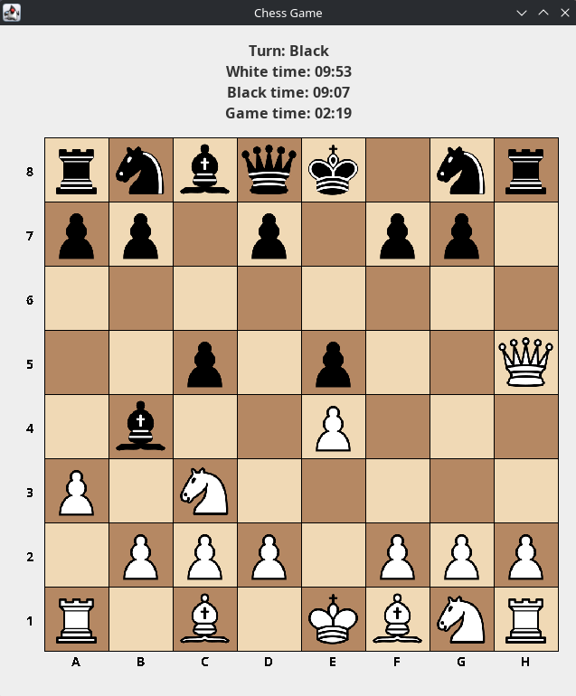
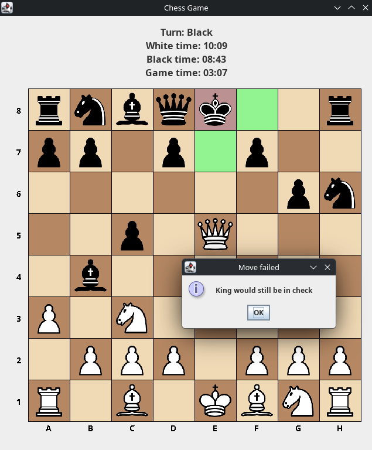
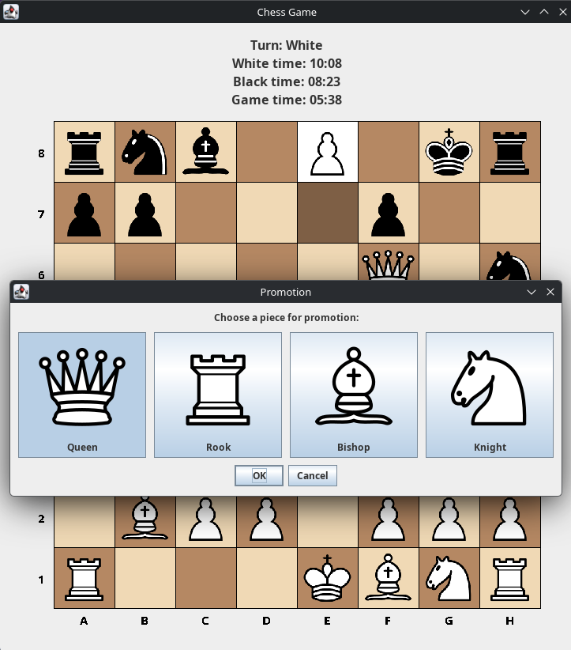
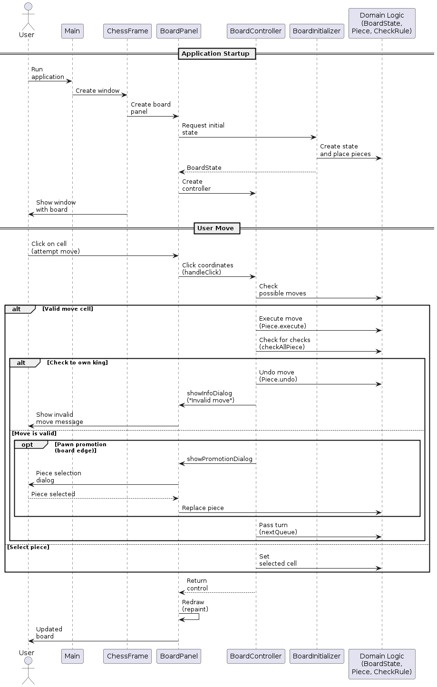

# Chess Blitz Game

[](https://github.com/hafn-g/chess/releases)
[](https://github.com/hafn-g/chess/actions)
[](https://opensource.org/licenses/MIT)


<div align="center">
  
</div>

A **chess game** played as **blitz rounds**, written entirely in **Java Swing** without any third-party libraries.

## Features

- **+10 seconds** added to the clock after each move
- Only the player whose turn it is can move
- Game ends immediately when any player runs out of time
- Pieces move **according to chess rules** – legal moves are highlighted
- A pawn reaching the last rank can promote to **Queen**, **Rook**, **Bishop**, or **Knight**
- When **check** is declared, only moves that resolve it are allowed
- Any move that would put your own king in **check** is canceled
- **Statistics panel** shows: whose turn, each player's remaining time, and total game time

## License
Distributed under the MIT License. See [`LICENSE`](./LICENSE) for more information.

## Getting Started

### Prerequisites
* **Java 25** or higher (due to the use of latest JVM features).

### Running the App
1. Download the latest `.jar` from the [Releases page](../../releases).
2. Run it via terminal:
   ```bash
   java -jar hafn-chess-1.0.0.jar
   ```
   *Or simply double-click the file if your OS associations are set up.*

### Building from source
If you want to build the project yourself:
```bash
git clone https://github.com/hafn-g/chess.git
cd chess
mvn clean package
```

## Invalid Move Notification

When a move is illegal (e.g., does not resolve check), a warning is shown.

<div align="center">
  
</div>

## Promotion Interface

If you don't choose a promotion piece, the pawn remains a pawn.

<div align="center">
  
</div>

## Project Structure

<details>
  <summary>Click to expand</summary>

```yaml
chess/
├── application/ # Application layer – connects domain and UI
│ ├── port/
│ │ ├── in/ # Input ports (user command interfaces)
│ │ │ └── BoardInputPort.java # Interface for processing user commands
│ │ └── out/ # Output ports (infrastructure interfaces)
│ │ ├── BoardRenderPort.java # Interface for rendering the board
│ │ ├── BoardStatePort.java # Interface for retrieving board state
│ │ └── SelectionPort.java # Interface for highlighting pieces/cells
│ └── usecase/ # Business case implementations (files not expanded)
├── bootstrap/ # Application startup and initialization
│ ├── BoardInitializer.java # Initializes the chessboard
│ └── Main.java # Application entry point
├── domain/ # Chess business logic
│ ├── model/ # Core business objects
│ │ ├── Cell.java # Board cell model
│ │ ├── HistoryMove.java # Move history
│ │ ├── PieceColor.java # Piece colors
│ │ └── PieceType.java # Piece types
│ ├── piece/ # Chess piece classes and moves
│ │ ├── Bishop.java, King.java, Knight.java, Pawn.java, Queen.java, Rook.java
│ │ ├── Move.java # Move description
│ │ └── Piece.java # Base piece class
│ ├── port/ # Interfaces for domain interaction
│ │ └── BoardPort.java # Main port for board operations
│ ├── service/ # Services and business rules
│ │ ├── CheckRule.java # Check detection
│ │ └── MoveHelperGenerator.java # Generates legal moves
│ └── state/ # Game state
│ └── BoardState.java # Current board state
└── ui/ # User interface
└── swing/ # Swing UI implementation
├── ChessFrame.java # Main application window
├── model/
│ └── BoardMetrics.java # Board display parameters
├── panel/
│ ├── BoardPanel.java # Chessboard panel
│ └── StatsPanel.java # Statistics panel
└── renderer/
├── BoardRenderer.java # Board rendering logic
└── ImageCache.java # Image caching
```

</details>

## Diagrams

### Application Overview

<div align="center">
  
</div>